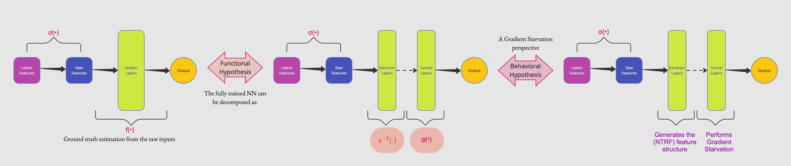
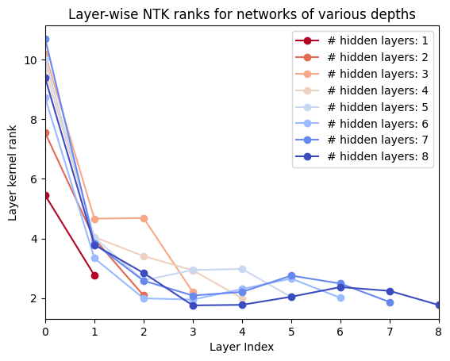

## Abstract
Contrary to the long-held understanding that *deeper* NNs have greater expressivity, it has recently been shown that in over-parameterized models, depth can induce a bias towards simpler representations. In particular, [Masarczyk et al.](http://arxiv.org/abs/2305.19753) observe a definitive separation of the behavior of NN layers: early layers (extractor), which are involved in building complex representations to fit the data, and later layers (tunnel), which compress the learned complex representation from the former into simpler ones. In this work, by adopting an NTK perspective, we provide a theoretical framework to understand this phenomenon. Specifically, we demonstrate the formation of an implicit encoder-decoder structure within an NN, with the encoder/decoder length determined by aspects of the data distribution and the choice of model architecture.
## Introduction
Deeper layers of neural networks are known to capture more complex representations or structures of the input data. However, a series of works ([Rahaman et al.](http://arxiv.org/abs/1806.08734), [Valle-Perez et al.](https://arxiv.org/abs/1805.08522), [Huh et al.](http://arxiv.org/abs/2103.10427), etc.) has recently challenged this view. They show that deep over-parameterized models tend to attain simpler functional forms, a.k.a a *simplicity bias*.  In particular, [Masarczyk et al.](http://arxiv.org/abs/2305.19753)observed that *beyond an optimal depth*, adding hidden layers causes the formation of simpler representations rather than increasingly complex ones. It is to be noted, though, that this simplicity bias is attributed to being a reason behind the poor OOD performance of deep NNs ([Shah et al.](https://proceedings.neurips.cc/paper_files/paper/2020/file/6cfe0e6127fa25df2a0ef2ae1067d915-Paper.pdf), [Tiwari & Shenoy](http://arxiv.org/abs/2301.13293)). 

To the best of our knowledge, while the individual aspects of increasing model expressivity with depth and simplicity bias in deep over-parameterized models have received significant standalone attention from the community, limited work ([Dandi and Jacot](http://arxiv.org/abs/2111.03972)) has been performed in unifying both under a single framework. 

In this work, we also attempt to bridge that gap further and additionally connect our results to a related observation, *last-layer retraining* ([Kirichenko et al.](https://arxiv.org/abs/2204.02937)). Last-layer retraining or, more generally, truncating deeper layers and retraining with linear headers ([Lee et al.](http://arxiv.org/abs/2210.11466), [Evci et al.](http://arxiv.org/abs/2201.03529)) have been suggested as a robustness measure against learning spurious correlations in the data. While all these works have attributed the vulnerability of the later layers to the phenomenon of simplicity bias, and hence the need for their retraining, they do not provide a systematic framework to determine the truncation depth nor why this is possible in the first place. In our work, we show that this depth corresponds to the length of the initial implicit encoder layer, the output of which is a coarse-grained (?) representation of the underlying latent features defining the raw inputs themselves. We then go on to show that the recovery of the latent features at intermediate depths is what allows for the above retraining strategy to work.
## Contributions [Old]
Latent Recovery
- In this work, we show that latent features underlying the input data to an NN are recovered at some intermediate depth.
	- Train a fully connected over-parameterized NN on MNIST. 
		- Achieve zero training error. 
		- At the end of the training, perform a CKA evaluation of the inter-layer rank and determine the set of extractor layers, i.e., the initial set of layers that have high CKA with each other.
		- Extract the output representation of this extractor layer for the input dataset. Keep aside.
	- Train an auto-encoder on the MNIST dataset. Determine an optimal bottleneck dimension.
		- Achieve ~zero recovery loss.
		- Extract the bottleneck layer representation for the input dataset.
	- Compute the CKA between the two extracted representations. Ideally, it should be close to 1
	- Repeat for Fashion-MNIST
	- Why not CIFAR? Answer: I am unsure how to implement the above effectively for ResNets.
NTK and Latent Recovery
- Take the Mode 3 setup on toy data., i.e., NTK with no training.
- The NTK ranks for varying depths have already been evaluated. 
- We now aim to study the NTK's *k*-top eigenvectors instead.
- Is there an efficient way to do that? I recall [Baratin et al.](https://proceedings.mlr.press/v130/baratin21a.html) tried something on NTK top eigenvector alignment to the task.
- Our objective is to test if, *post the optimal depth* (i.e., beyond which the NTKs rank starts to decrease monotonically), the top-eigenvectors of the NTK for, say, *optimal depth + 1* and *optimal depth + 2* ... *optimal depth + n* are the same. It is just that the associated eigenvalues/singular values concentrate toward the top eigenvector itself (gradient starvation). This causes the soft rank reduction.
## Related Work
- Simplicity bias: [Rahaman et al.](http://arxiv.org/abs/1806.08734), [Valle-Perez et al.](https://arxiv.org/abs/1805.08522), [Huh et al.](http://arxiv.org/abs/2103.10427)
- Spurious correlation and over-parameterization: [Sagawa et al.](https://arxiv.org/abs/2005.04345), [Shah et al.](https://proceedings.neurips.cc/paper/2020/hash/6cfe0e6127fa25df2a0ef2ae1067d915-Abstract.html), 
- Metrics: [Novak et al.](http://arxiv.org/abs/1802.08760), [Cortes et al.](https://dblp.org/rec/journals/jmlr/CortesMR12)
- Linear probing: [Alain and Bengio](https://arxiv.org/abs/1610.01644)
- NTK and depth: [Yang and Salman](http://arxiv.org/abs/1907.10599), [Dandi and Jacot](http://arxiv.org/abs/2111.03972), [Canatar and Pehlevan](https://ieeexplore.ieee.org/abstract/document/9929375)
- Final layers retraining: [Lee et al.](http://arxiv.org/abs/2210.11466), [Evci et al.](http://arxiv.org/abs/2201.03529), [Kirichenko et al.](https://arxiv.org/abs/2204.02937)
## Objective and Setup
Our goal is to connect the following results presented in three articles:
- Retraining the last layer(s) of a NN improves OOD performance. [Kirichenko et al.](https://arxiv.org/abs/2204.02937)
- The layers of a trained feedforward NN can be decomposed into extractor and tunnel layers or modules. The extractor extracts linearly separable features while the tunnel compresses the extracted representations along certain principal directions. Based on related works on representation compression effects in NNs, the tunnel can be attributed to inducing poor OOD performance. [Masarczyk et al.](http://arxiv.org/abs/2305.19753)
- Stronger *features* starve the learning of weaker ones, i.e., weights associated with the latter are ~ 0 [Pezeshki et al.](https://arxiv.org/abs/2011.09468). Note: Bear in mind that the GS work of [Pezeshki et al.](https://arxiv.org/abs/2011.09468) deals with an NTK formulation of the whole NN, not just its final set of layers.

In essence, we aim to show that the observation of the last layer retraining in improving OOD performance is a special case of removing the tunnel layer(s) as a whole with a linear header followed by training it. On the other hand, the reason the tunnel layers act the way they do can be understood to be gradient starvation effects.

Our objective then reduces to understanding how a linearly separable feature representation is generated in the first place (in an NN), followed by how the subsequent layers perform the GS effect.

> Problem Statement: 
> - Show that the $U$ eigenvector structure of [Pezeshki et al.](https://arxiv.org/abs/2011.09468) arises post a critical depth of the underlying neural network pinning the NTK
> - Show that post the critical model depth, the U structure remains fairly constant while the strength matrix $S$ gets further imbalanced along the stronger 'feature'

Accomplishments till now and what next?:
 >- Part 1:
> 	- Set up a data distribution with one core, one spurious, and one noise feature with $\pm1$ labels.
> 	- Trained NNs of different depths on it. 
> 	- Computed ranks of various entities, CKA similarity score, etc., from these trained models.
> - Part 2:
> 	- Repeated the above experiment for datasets from [Baratin et al.](https://proceedings.mlr.press/v130/baratin21a.html) 
> 	- Additionally, the behavior of the NTK of the trained models of various depths - specifically, the right eigenvectors matrices of the NTRF, was investigated.
> 	- Observed better task alignment (as visible by plotting eigenvectors from the $V$ matrices) with increasing model depth
> 	- Observed that the rank of the NTK for models of various depths exhibited a peak at a specific depth (could be interesting)
> - Part 3:
> 	- Computed the latents for MNIST and CIFAR-10 datasets via an SSL (DINO) method and evaluated its CKA similarity with the hidden layer representations of models trained on these datasets. 
> 	- Did not observe a direct correlation between the peak of the layer ranks and the peak in the CKA similarity between the computed latents and the layer representations.
- Latents:
	- It is clear that to investigate the possibility of latent recovery via the extractor layers; we will have to consider non-linear transformations from the latent and the raw inputs space, to begin with. This is a challenge from an analytical standpoint.
	- To make progress, we take inspiration from [Gerace et al.](https://proceedings.mlr.press/v119/gerace20a/gerace20a.pdf) make the following design choice for the data generation part:
## Theoretical Analysis
Data generation: ${\bf{x}} = \sigma(\frac{1}{\sqrt{d}}{\bf{c}\cdot F}) \in R^{n\times d}$, with $\mathbf{c}\in R^{n\times p}$ being the latents, and $\sigma$ referring to an activation function. 
Similarly, the targets are generated as $Y = g(\frac{1}{\sqrt{d}}c\cdot\theta)$. 

Our goal is two-fold:
1) We demonstrate, in corroboration of the results of [Yang and Salman](http://arxiv.org/abs/1907.10599), that the rank of the NTK of increasing model depths possesses a peak at some critical depth. $\to$ this sets up the point where the extractor forms
	1) This depth depends on some complexity measure of the data distribution.
	2) The top-$k$ spectral values show increasing concentration towards the top $k'$ < $k$ spectral concentration with depth beyond this critical depth
2) Furthermore, at this critical depth, the left eigenfunctions of the NTRF matrix $\Phi(x)\in\mathcal{R}^{p\times n}$ of this respective model ($p$: number of parameters, $n$: number of examples) exhibits significant alignment with the latent distribution covariance matrix $\to$ this is the latent recovery part
## Experimental Results
The dataset is chosen to be `yinyang`. The dataset has an associated binary label. 

Eight networks were trained till convergence on this dataset, with their hidden layers ranging from 1 to 8. At the *end of the training*, we calculate the following:
1. The individual layer ranks of each of the trained models.
2. The CKA similarity amongst the trained layers of each of the models.
3. The NTKs of each of the trained models.
4. The so-called layer-wise NTKs of each of the trained models.
1, 2 from above result in: 

On the other hand, the *top-k* eigenvectors of each of the full NTKs result in:

On plotting the ranks of the full NTK for each model give us:

Lastly, the layer-wise NTKs of these models, yields:

## Discussion
## Conclusion
In this article, we have explored the intriguing interplay between increasing model depth and the emergence of a simplicity bias in deep over-parameterized neural networks, a topic that has sparked considerable debate and investigation in recent research. Our analysis builds upon and unifies the previously isolated findings of Valle-Perez et al., Huh et al., Masarczyk et al., Shah et al., and Tiwari & Shenoy, offering a comprehensive framework that not only encapsulates the phenomena of model expressivity and simplicity bias but also delves into the practical implications of last-layer retraining as a robustness strategy. By identifying the truncation depth with the span of the initial implicit encoder layer, our work sheds light on the underlying mechanics that enable the preservation and recovery of latent features, thus facilitating effective retraining strategies. This insight not only advances our understanding of the structural dynamics within neural networks but also proposes a methodical approach to enhancing model robustness against spurious correlations. As the field continues to evolve, we anticipate that our findings will serve as a foundation for future research aimed at optimizing neural network design for both performance and reliability, particularly in out-of-distribution contexts.

----

We wanted to extract and study the hidden layer representations of a trained feed forward neural network