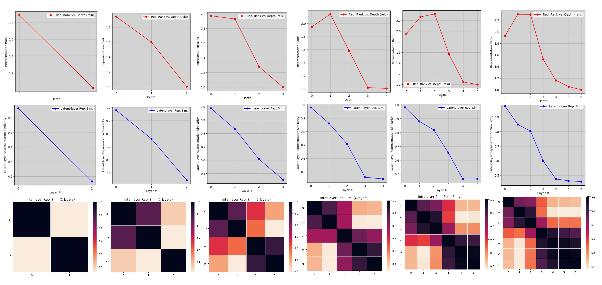

# Deep Learning Robustness & Simplicity Bias Analysis

This repository contains the experimental framework and preliminary results for investigating the phenomenon of **Simplicity Bias** in deep neural networks and its impact on Out-Of-Distribution (OOD) robustness.

## 🎯 Project Goal
The primary objective of this project is to unify theories of model expressivity and simplicity bias. Specifically, we aim to demonstrate that deep neural networks naturally decompose into two distinct functional components:

1.  **Extractor Layers:** Early layers that learn complex, linearly separable features from the input data.
2.  **Tunnel Layers:** Later layers that compress these representations, behaving linearly and potentially discarding critical information needed for OOD generalization.

We hypothesize that removing or retraining these "tunnel" layers (e.g., via last-layer retraining) can recover the richer latent features learned by the extractor, thereby improving robustness.

---

## 🧪 Methodology
We employ a rigorous analytical framework to dissect trained models:

### 1. Neural Tangent Kernel (NTK) Analysis
We compute the NTK and its properties to understand training dynamics and feature learning:
*   **Full NTK Rank:** Monitoring the effective dimensionality of the model's feature space across different depths.
*   **Layer-wise NTK:** Analyzing how individual layers contribute to the final kernel.
*   *Key Finding:* We observe a peak in NTK rank at a critical depth, suggesting the transition from "extractor" to "tunnel" behavior.

### 2. Centered Kernel Alignment (CKA)
We use CKA (Linear and RBF) to measure the similarity between:
*   Representations of different layers within the same model (Internal CKA).
*   Layer representations and the true latent features of the data (Latent CKA).

### 3. Rank & Entropy Analysis
We compute the "soft rank" and Shannon entropy of layer weight matrices and representations to quantify the information flow and compression through the network.

---

## 📊 Experimental Setup

### Datasets (`utils/data.py`)
We utilize controlled "toy" datasets to isolate specific learning behaviors:
*   **Yin-Yang Dataset:** A 2D non-linear classification task with distinct geometric structures.
    *   
*   **Core vs. Spurious Features:** High-dimensional datasets where labels are correlated with both a "core" feature (hard to learn, robust) and a "spurious" feature (easy to learn, brittle).
*   **Hidden Manifold Model:** Data generated from low-dimensional latent patterns mapped to high-dimensional inputs.

### Models (`utils/toy_model.py`)
*   **Architecture:** Configurable Multi-Layer Perceptrons (MLPs) with variable depth and width.
*   **Activations:** Support for ReLU, Tanh, Sigmoid, Quadratic, and Linear activations.

### Training (`utils/misc.py`)
*   Standard SGD/Adam optimization.
*   Early stopping based on loss convergence or classification error.
*   Supports GPU acceleration.

---

## 📈 Key Results (Preliminary)

### Layer-wise Representation Similarity
We observe distinct patterns in how layers represent data, with deep networks showing a high degree of similarity in later layers (the "tunnel").


### NTK Rank Evolution
The rank of the Neural Tangent Kernel evolves with depth, providing a signal for where the model stops learning new features and starts compressing them.


---

## 📂 Repository Structure
```
.
├── utils/
│   ├── data.py       # Data generation (Yin-Yang, Core/Spurious, etc.)
│   ├── toy_model.py  # Model architectures (MLP, NTK implementation)
│   ├── misc.py       # Training loop, CKA, Rank, and Analysis tools
│   └── plot.py       # Visualization utilities
├── figs/             # Generated plots and visual artifacts
├── notes.txt         # Research notes and roadmap
└── README.md         # This file
```

## 🚀 Usage
1.  Configure experiment parameters in `utils/data.py` (e.g., varying `p` for spurious correlation strength).
2.  Train models using the scripts in the root directory (to be added/consolidated).
3.  Run analysis tools from `utils/misc.py` to generate plots in `figs/`.
