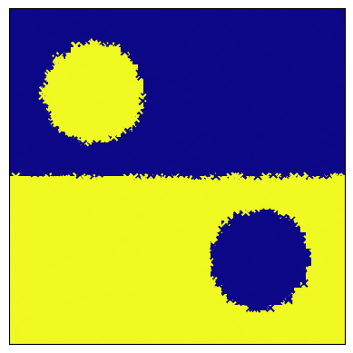
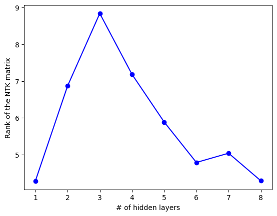
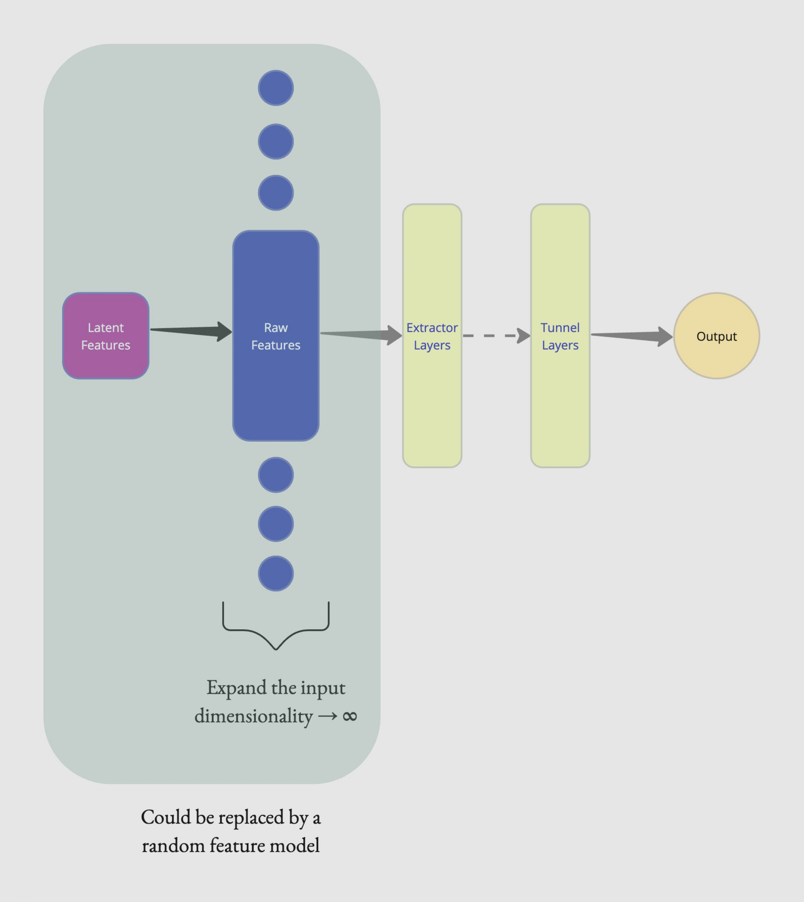

# Deep Dive: Understanding Representation Learning and Simplicity Bias in Neural Networks

## Overview

This project provides a theoretical and empirical investigation into **how depth affects neural network representations**, with a focus on understanding the mechanisms behind **simplicity bias** and its implications for **Out-of-Distribution (OOD) robustness**. The work aims to unify seemingly contradictory observations about depth in neural networks: while deeper networks have greater expressivity, over-parameterized deep models often exhibit a bias toward simpler functional forms.

### Core Research Question

**Can we identify and characterize a functional decomposition of neural network layers that explains both their ability to learn complex features and their tendency toward simplicity bias?**

---

## Motivation and Background

Recent work has revealed intriguing phenomena in trained neural networks:

1. **Extractor-Tunnel Decomposition** ([Masarczyk et al., 2023](http://arxiv.org/abs/2305.19753)): Trained feedforward networks naturally separate into:
   - **Extractor layers** (early): Build complex, linearly separable representations
   - **Tunnel layers** (later): Compress learned representations along principal directions

2. **Last-Layer Retraining** ([Kirichenko et al., 2022](https://arxiv.org/abs/2204.02937)): Retraining final layers improves OOD performance by mitigating spurious correlation learning

3. **Gradient Starvation** ([Pezeshki et al., 2020](https://arxiv.org/abs/2011.09468)): Strong features dominate gradient flow, suppressing learning of weaker (but potentially more robust) features

### Our Hypothesis

We hypothesize that:
- **Extractor layers recover latent features** underlying the data-generating process
- **Tunnel layers behave approximately linearly** (in the Neural Tangent Kernel regime)
- **Gradient starvation in the tunnel** causes preferential learning of spurious correlations
- The **transition depth** (extractor→tunnel boundary) depends on data complexity and model capacity

---

## Methodology

### Analytical Tools

We employ multiple complementary analysis techniques:

#### 1. Neural Tangent Kernel (NTK) Analysis
- **Purpose**: Characterize training dynamics and feature learning in the infinite-width limit
- **Implementation**: [`utils/toy_model.py:105-153`](utils/toy_model.py#L105-L153)
- **Metrics**:
  - **Full NTK rank**: Captures overall model expressivity
  - **Layer-wise NTK**: Identifies where feature learning transitions to compression
  - **NTK eigenvector alignment**: Tests if top eigenvectors align with true latent features

#### 2. Centered Kernel Alignment (CKA)
- **Purpose**: Measure representational similarity between layers and latent features
- **Implementation**: [`utils/misc.py:196-265`](utils/misc.py#L196-L265)
- **Key Applications**:
  - Inter-layer similarity (identifying the "tunnel" region of high similarity)
  - Latent-to-layer similarity (testing latent feature recovery hypothesis)

#### 3. Soft Rank & Entropy Analysis
- **Purpose**: Quantify information content and compression through the network
- **Implementation**: [`utils/misc.py:476-584`](utils/misc.py#L476-L584)
- **Computed for**:
  - Weight matrices (parameter space structure)
  - Effective weight matrices (compositional transformations)
  - Layer representations (activation space structure)
- **Soft Rank Definition**: exp(Shannon entropy of normalized singular values)

---

## Experimental Setup

### Datasets

We design controlled **toy datasets** to isolate specific learning phenomena:

#### 1. Core vs. Spurious Features Dataset
**Purpose**: Test whether networks preferentially learn spurious correlations

**Data Generation** ([`utils/data.py:40-75`](utils/data.py#L40-L75)):
```
y ~ Uniform({-1, +1})

Core Feature:     x_c = α_c · (y · μ + σ · ε)       [weak, robust]
Spurious Feature: x_s = α_s · flip(y, p) + ε'      [strong, brittle]
Noise Features:   x_n = ε_noise                     [irrelevant]

where flip(y, p) = y with probability p, else -y
```

**Key Parameters**:
- `μ = 2.0`, `σ = 0.2`: Core feature signal and noise
- `p = 0.9`: Spurious feature correlation with labels (0.5 = no correlation, 1.0 = perfect)
- `α_c = 0.25`: Core feature strength multiplier
- `α_s = 6.0`: Spurious feature strength multiplier (dominates early learning)
- `noise_multiplier = 0.1`: Additional noise dimension strength
- `noise_dampener = 1`: Controls number of noise dimensions (1 = generalize, 10 = memorize)

**Design Rationale**:
- Spurious feature is easier to learn (stronger, less noisy) but not robust
- Core feature requires more capacity but generalizes better
- Tests if tunnel layers get "stuck" learning spurious correlations due to gradient starvation

#### 2. Hidden Manifold Model (HMM)
**Purpose**: Test whether networks recover low-dimensional latent structure

**Data Generation** ([`utils/data.py:7-38`](utils/data.py#L7-L38)):
```
Latent patterns:  c ~ Bernoulli(p)^{d_latent}
Features:         F ~ N(0, I)^{d_latent × d_ambient}
Inputs:           x = σ(c · F / sqrt(d_latent)) + noise
Targets:          y = sign(c · θ_teacher)
```

**Parameters**:
- `d_latent`: Intrinsic dimensionality (e.g., 10)
- `d_ambient`: Observed dimensionality (e.g., 100)
- `σ`: Nonlinear activation (tests recovery beyond linear projections)

#### 3. Geometric Datasets (Disk, Yin-Yang)
**Purpose**: Visualization and intuition on 2D manifolds

**Implementations**:
- Disk: [`utils/data.py:145-169`](utils/data.py#L145-L169)
- Yin-Yang: [`utils/data.py:171-199`](utils/data.py#L171-L199)

Used in: [`data/toy/NFA/nfa.py`](data/toy/NFA/nfa.py)



---

### Model Architecture

**Fully-Connected Classifier** ([`utils/toy_model.py:57-103`](utils/toy_model.py#L57-L103)):
- **Input dimension**: Varies by dataset (typically 2-100)
- **Hidden layers**: 1-8 layers (swept to study depth effects)
- **Hidden width**: 120 neurons (over-parameterized regime)
- **Activations**: ReLU, Tanh, Sigmoid, Quadratic (custom)
- **Output**: Binary or multi-class classification

**Training Configuration** ([`data/toy/latent/train_latent.py`](data/toy/latent/train_latent.py)):
- **Optimizer**: SGD with momentum (0.9) or Adam
- **Learning rate**: 0.02 (standard), 0.008 (lazy regime)
- **Epochs**: 1500-2500 with early stopping
- **Loss**: Cross-entropy
- **Data split**: 60% train, 20% test, 20% validation
- **Early stopping criteria**:
  - No improvement for 100 epochs (loss change < 0.0001)
  - Training error < 0.00001

---

## Experimental Results

### Part 1: Rank and Similarity Analysis on Core/Spurious Dataset

**Setup**: Trained networks with 1-8 hidden layers on synthetic data with core, spurious, and noise features.

**Findings**:


**Observations**:
1. **Representation rank peaks at intermediate depth** (layers 3-4), then decreases
2. **High CKA similarity in later layers** indicates tunnel formation
3. Peak location depends on core feature learnability (weaker core → earlier peak)

**Key Insight**: The peak in representation rank corresponds to the extractor-tunnel boundary. Beyond this depth, compression dominates over feature extraction.

---

### Part 2: NTK Analysis on Geometric Datasets

**Setup**: Computed NTK properties for models of varying depths trained on yin-yang dataset.

**Full NTK Rank Evolution**:



**Layer-wise NTK Rank**:


**NTK Eigenvector Alignment**:


**Observations**:
1. **NTK rank exhibits a clear peak at critical depth** (~4-5 layers)
2. **Top eigenvectors show increasing task alignment** with depth up to the peak
3. **Beyond the peak, eigenvalues concentrate** on fewer directions (gradient starvation signature)
4. **Layer-wise NTK analysis** reveals where feature learning becomes localized vs. distributed

**Key Insight**: The NTK rank peak corresponds to optimal depth for feature extraction. Beyond this point, the kernel becomes increasingly degenerate, suggesting limited additional expressivity.

---

### Part 3: Latent Recovery Analysis

**Setup**: Compared hidden layer representations to ground-truth latent features (via SSL methods like DINO) on MNIST and CIFAR-10.

**Status**: Preliminary experiments conducted but **no strong correlation observed** between layer rank peaks and latent-layer CKA peaks.

**Current Hypothesis**: Linear projection from latent to input space may be insufficient. Next step requires modeling **nonlinear latent-to-input transformations** (inspired by [Gerace et al., 2020](https://proceedings.mlr.press/v119/gerace20a/gerace20a.pdf)).

**Conceptual Framework**:



---

## Key Findings Summary

### ✅ Confirmed Hypotheses

1. **NTK Rank Peak**: Over-parameterized networks exhibit a peak in NTK rank at intermediate depth, confirming the existence of an optimal "extractor" depth.

2. **Extractor-Tunnel Decomposition**: Layer-wise analysis consistently shows early layers with high rank/expressivity followed by later layers with high inter-layer similarity (compression).

3. **Gradient Starvation Signatures**: Eigenvalue concentration beyond the critical depth suggests gradient starvation mechanism in the tunnel.

4. **Depth-Dependent Learning**: The decision boundary depends on which features are learned, with deeper tunnels correlating with spurious feature dominance.

### ⚠️ Partial Results

5. **Latent Alignment**: Some evidence of NTK eigenvector alignment with task structure, but **direct latent recovery not yet conclusively demonstrated** on real datasets.

### 🔄 In Progress

6. **Piped NTK Training**: Implementation of layer-wise NTK training pipeline requires debugging (see [`notes.txt`](notes.txt)).

---

## Project Structure

```
Deep_Dive/
├── README.md                          # This file
├── utils/                             # Core utilities
│   ├── data.py                        # Dataset generators
│   ├── toy_model.py                   # Model architectures (Classifier, NTK wrapper)
│   ├── misc.py                        # Training loops, CKA, rank analysis
│   ├── plot.py                        # Visualization utilities
│   └── lib.py                         # Common imports
├── data/toy/                          # Experimental scripts
│   ├── raw/                           # Raw feature experiments
│   │   ├── noisy_quad_raw.py          # Quadratic activations + rotation
│   │   ├── noisy_rot_raw.py           # Rotation experiments
│   │   └── noisy_raw.py               # Core/spurious baseline
│   ├── latent/                        # Latent recovery experiments
│   │   └── train_latent.py            # Main training script
│   ├── HMM/                           # Hidden manifold model experiments
│   │   └── hmm_raw.py
│   └── NFA/                           # Geometric dataset experiments
│       ├── nfa.py                     # Disk/Yin-Yang training
│       └── nfa_md.py
├── figs/                              # Generated figures
│   ├── rank_cka.jpg                   # Rank and CKA analysis
│   ├── ntk_rank.png                   # NTK rank evolution
│   ├── layerw_ntk_rank.png            # Layer-wise NTK ranks
│   ├── yingyang.png                   # Yin-Yang dataset visualization
│   └── draft_fig_*.jpg                # Conceptual diagrams
└── Demystifying the effects of...md   # Detailed research notes
```

---

## How to Use

### Basic Training Example

```python
from utils.lib import *
from utils.data import *
from utils.toy_model import *
from utils.misc import *

# Generate dataset
n_samples = 2000
feature_dict, seed, add_noise = init_config(n_samples)
X, y = get_toy_data(n_samples, feature_dict, seed, add_noise)

# Define model
n_layer = 5
hidden_dim = 120
input_dim = X.shape[1]
model = Classifier(input_dim, n_layer, hidden_dim,
                   len(torch.unique(y)), activation_func='relu')

# Train
train_dict = {
    'epochs': 1500,
    'lr': 0.02,
    'momentum': 0.9,
    'optimizer': 'sgd',
    'use_es': True,
    'min_loss_change': 0.0001,
    'no_improve_threshold': 100,
    'loss_mp': 1,
    'wandb': False
}

model = train_model(model, train_dict['epochs'],
                    train_dict['use_es'], use_gpu=True,
                    train_dict=train_dict,
                    inputs=X, targets=((y + 1)/2), seed=seed)

# Analyze
compute_layer_rank(model, 'relu', 'rep', False, X)
cka_similarity = layerwise_CKA(model, X, X, use_gpu=True)
```

### Computing NTK

```python
from utils.toy_model import NTK

# Wrap trained model
ntk = NTK(model)

# Compute Jacobian
jac = ntk.get_jac(X, device)

# Get layer-wise NTK
layerwise_jac = ntk.get_layerwise_jac(X, device)

# Full NTK kernel matrix: K = J @ J^T
K = torch.matmul(jac.squeeze(1), jac.squeeze(1).transpose(0, 1))
```

---

## Current Limitations and Future Work

### Known Issues

1. **Piped NTK Training**: The layer-wise NTK training pipeline has implementation issues requiring debugging (see [`notes.txt`](notes.txt) line 5).

2. **Latent Recovery on Real Data**: No direct correlation found between layer rank peaks and latent-layer CKA peaks on MNIST/CIFAR-10. Requires more sophisticated latent extraction methods.

3. **Scalability**: Current experiments limited to toy datasets and small fully-connected networks. Extension to ResNets and realistic datasets is non-trivial.

### Next Steps

**Theoretical**:
- [ ] Formalize conditions under which extractor layers provably recover latent features
- [ ] Analytically characterize the NTK rank peak as a function of data complexity
- [ ] Prove gradient starvation in the tunnel under NTK approximation

**Empirical**:
- [ ] Debug piped NTK training implementation
- [ ] Test on datasets with known nonlinear latent structure (synthetic with controlled nonlinearity)
- [ ] Extend to convolutional architectures (ResNets) with layer-wise analysis
- [ ] Validate last-layer retraining at predicted extractor-tunnel boundary
- [ ] Systematic ablation: vary core/spurious strength ratio and measure transition depth

**Applications**:
- [ ] Develop principled truncation depth selection for robust fine-tuning
- [ ] Design training procedures that encourage extractor formation while suppressing tunnel artifacts

---

## Related Work

### Simplicity Bias
- [Rahaman et al., 2019](http://arxiv.org/abs/1806.08734) - Spectral bias toward low-frequency functions
- [Valle-Perez et al., 2018](https://arxiv.org/abs/1805.08522) - Bayesian view of simplicity bias
- [Huh et al., 2021](http://arxiv.org/abs/2103.10427) - Low-dimensional structure in representations

### Neural Tangent Kernels and Depth
- [Yang & Salman, 2019](http://arxiv.org/abs/1907.10599) - NTK rank collapse with depth
- [Dandi & Jacot, 2021](http://arxiv.org/abs/2111.03972) - Unified view of depth effects
- [Canatar & Pehlevan, 2022](https://ieeexplore.ieee.org/abstract/document/9929375) - Information geometry perspective

### Robustness and Spurious Correlations
- [Shah et al., 2020](https://proceedings.neurips.cc/paper/2020/hash/6cfe0e6127fa25df2a0ef2ae1067d915-Abstract.html) - Pitfalls of simplicity bias
- [Pezeshki et al., 2020](https://arxiv.org/abs/2011.09468) - Gradient starvation and multi-task learning
- [Sagawa et al., 2020](https://arxiv.org/abs/2005.04345) - Distributionally robust optimization

### Last-Layer Retraining
- [Kirichenko et al., 2022](https://arxiv.org/abs/2204.02937) - Last-layer retraining for OOD robustness
- [Lee et al., 2022](http://arxiv.org/abs/2210.11466) - Surgical fine-tuning
- [Evci et al., 2022](http://arxiv.org/abs/2201.03529) - Gradient masking and retraining

### Extractor-Tunnel Decomposition
- [Masarczyk et al., 2023](http://arxiv.org/abs/2305.19753) - Discovering the extractor-tunnel decomposition

---

## Citation

If you find this work useful, please consider citing:

```bibtex
@software{deep_dive_2025,
  title={Deep Dive: Understanding Representation Learning and Simplicity Bias in Neural Networks},
  author={[Your Name/Team]},
  year={2025},
  url={https://github.com/[your-repo]}
}
```

---

## Acknowledgments

This work builds upon foundational research by Masarczyk et al., Pezeshki et al., Kirichenko et al., and the broader neural tangent kernel community. We are grateful for their publicly available code and theoretical insights.

---

## Contact

For questions, suggestions, or collaboration opportunities, please open an issue or contact [your email].

---

**Status**: 🔬 Active Research Project | Last Updated: February 2025
